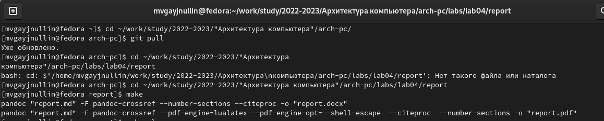
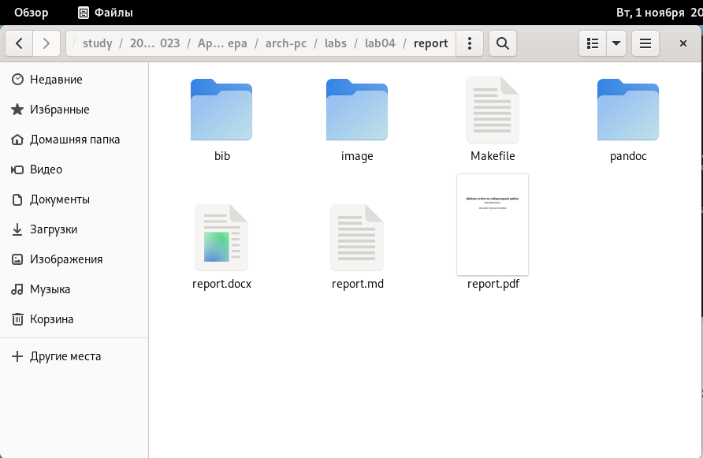

---
## Front matter
title: "Лабораторная номер 4"
author: "Гайнуллин Максим Васильевич"

## Generic otions
lang: ru-RU
toc-title: "Содержание"

## Bibliography
bibliography: bib/cite.bib
csl: pandoc/csl/gost-r-7-0-5-2008-numeric.csl

## Pdf output format
toc: true # Table of contents
toc-depth: 2
lof: true # List of figures
lot: true # List of tables
fontsize: 12pt
linestretch: 1.5
papersize: a4
documentclass: scrreprt
## I18n polyglossia
polyglossia-lang:
  name: russian
  options:
	- spelling=modern
	- babelshorthands=true
polyglossia-otherlangs:
  name: english
## I18n babel
babel-lang: russian
babel-otherlangs: english
## Fonts
mainfont: PT Serif
romanfont: PT Serif
sansfont: PT Sans
monofont: PT Mono
mainfontoptions: Ligatures=TeX
romanfontoptions: Ligatures=TeX
sansfontoptions: Ligatures=TeX,Scale=MatchLowercase
monofontoptions: Scale=MatchLowercase,Scale=0.9
## Biblatex
biblatex: true
biblio-style: "gost-numeric"
biblatexoptions:
  - parentracker=true
  - backend=biber
  - hyperref=auto
  - language=auto
  - autolang=other*
  - citestyle=gost-numeric
## Pandoc-crossref LaTeX customization
figureTitle: "Рис."
tableTitle: "Таблица"
listingTitle: "Листинг"
lofTitle: "Список иллюстраций"

## Misc options
indent: true
header-includes:
  - \usepackage{indentfirst}
  - \usepackage{float} # keep figures where there are in the text
  - \floatplacement{figure}{H} # keep figures where there are in the text
---

# Цель работы
Целью работы является освоение процедуры оформления отчетов с помощью
легковесного языка разметки Markdown.

# Задание

Освоить процедуры оформления отчетов с помощью Markdown

# Выполнение лабораторной работы

1) Перешёл в каталог курса, сформированный при выполнении лаборатор-
ной работы No3

2)Обновил локальный репозиторий, скачав изменения из удаленного репози-
тория с помощью команды

3)Перешёл в каталог с шаблоном отчета по лабораторной работе No 4 

4)Провёл компиляцию шаблона с использованием Makefile

 (рис. [-@fig:001])
 
5)Проверил файлы 
(рис. [-@fig:002])

6)Открыл файл report.md c помощью любого текстового редактора, например gedit

{ #fig:001 width=70% }

{ #fig:002 width=70% }

# Выводы
Я освоил процедуры оформления отчетов с помощью
легковесного языка разметки Markdown.

