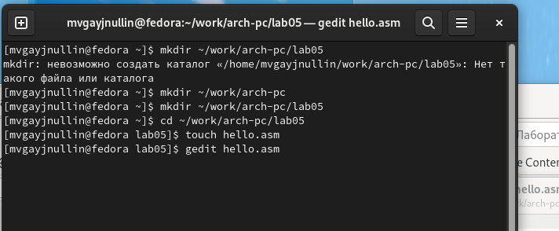
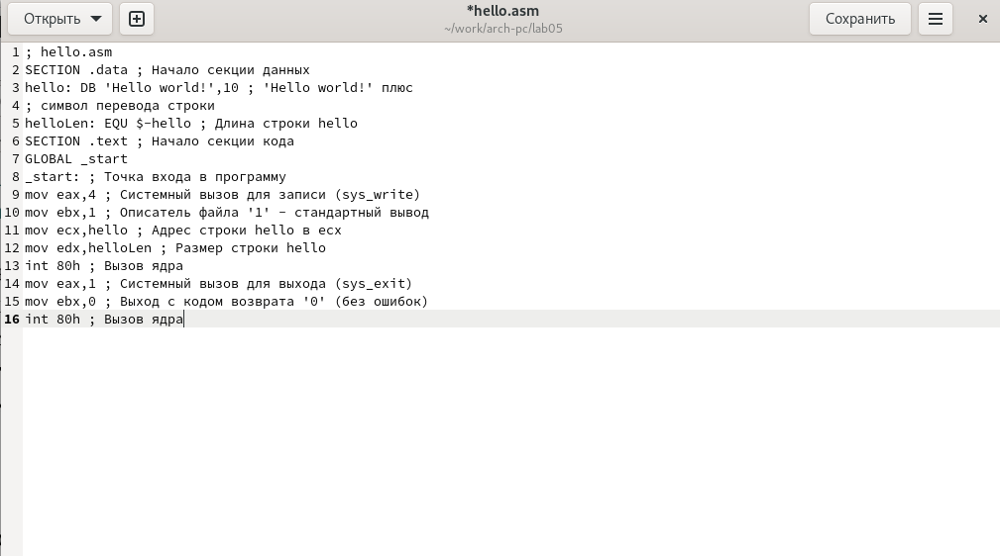
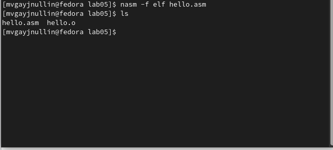
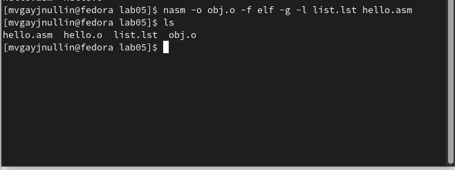
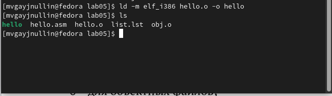
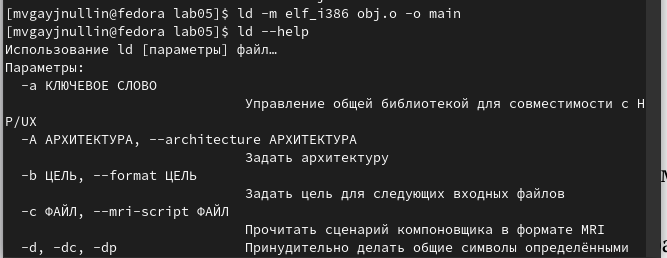
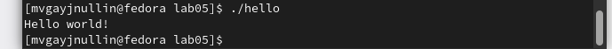
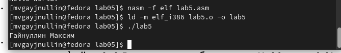

---
## Front matter
title: "Лабораторная работа 5"

author: "Гайнуллин Максим Васильевич"

## Generic otions
lang: ru-RU
toc-title: "Содержание"

## Bibliography
bibliography: bib/cite.bib
csl: pandoc/csl/gost-r-7-0-5-2008-numeric.csl

## Pdf output format
toc: true # Table of contents
toc-depth: 2
lof: true # List of figures
lot: true # List of tables
fontsize: 12pt
linestretch: 1.5
papersize: a4
documentclass: scrreprt
## I18n polyglossia
polyglossia-lang:
  name: russian
  options:
	- spelling=modern
	- babelshorthands=true
polyglossia-otherlangs:
  name: english
## I18n babel
babel-lang: russian
babel-otherlangs: english
## Fonts
mainfont: PT Serif
romanfont: PT Serif
sansfont: PT Sans
monofont: PT Mono
mainfontoptions: Ligatures=TeX
romanfontoptions: Ligatures=TeX
sansfontoptions: Ligatures=TeX,Scale=MatchLowercase
monofontoptions: Scale=MatchLowercase,Scale=0.9
## Biblatex
biblatex: true
biblio-style: "gost-numeric"
biblatexoptions:
  - parentracker=true
  - backend=biber
  - hyperref=auto
  - language=auto
  - autolang=other*
  - citestyle=gost-numeric
## Pandoc-crossref LaTeX customization
figureTitle: "Рис."
tableTitle: "Таблица"
listingTitle: "Листинг"
lofTitle: "Список иллюстраций"
lolTitle: "Листинги"
## Misc options
indent: true
header-includes:
  - \usepackage{indentfirst}
  - \usepackage{float} # keep figures where there are in the text
  - \floatplacement{figure}{H} # keep figures where there are in the text
---

# Цель работы

Освоение процедуры компиляции и сборки программ, написанных на ассмеблере NASM

# Выполнение лабораторной работы
1) Создаем каталог для работы и переходим в него
2) Убедившись, что мы в каталоге, создаём текстовый файл с именем helloy.asm и открываем его

 (рис. [-@fig:001]) 
 
 3) Вводим в него текст 
 
 (рис. [-@fig:002]) 
 
 4) Компилируем файл нашей программы и проверяем его наличие
 
 (рис. [-@fig:003]) 
 
 5) Компилируем исходный файл helloy.asm в obj.o и создаем файл листинга list.lst и проверяем его наличие 
 
 (рис. [-@fig:004]) 
 
 6) Создаем исполняемый файл и проверяем, чтобы он был создан 
 
 (рис. [-@fig:005]) 
 
 7) Создаем исполняемый файл main из объектного файла obj.o 
 
 (рис. [-@fig:006]) 
 
 8) Запускаем созданный файл и видим результат 
 
 (рис. [-@fig:007]) 
 
 
 
 Выполнение самостоятельной работы
 
  Копируем helloy.asm с именем lab5.asm, редактируем строчку Helloy world! для того, чтобы она отображала фамилию и имя, и вводим команды 
  nasm -f elf lab5.asm  ld -m elf_i386 lab.o lab5 
  для создания исполняемого файла и проверяем его работу
  
  
 (рис. [-@fig:008]) 
 
 
 
 
 

{ #fig:001 width=70% }

{ #fig:002 width=70% }

{ #fig:003 width=70% }

{ #fig:004 width=70% }

{ #fig:005 width=70% }

{ #fig:006 width=70% }

{ #fig:008 width=70% }

{ #fig:009 width=70% }

# Выводы

Освоил процедуры компиляции и сборки программ, написанных на ассмеблере NASM

