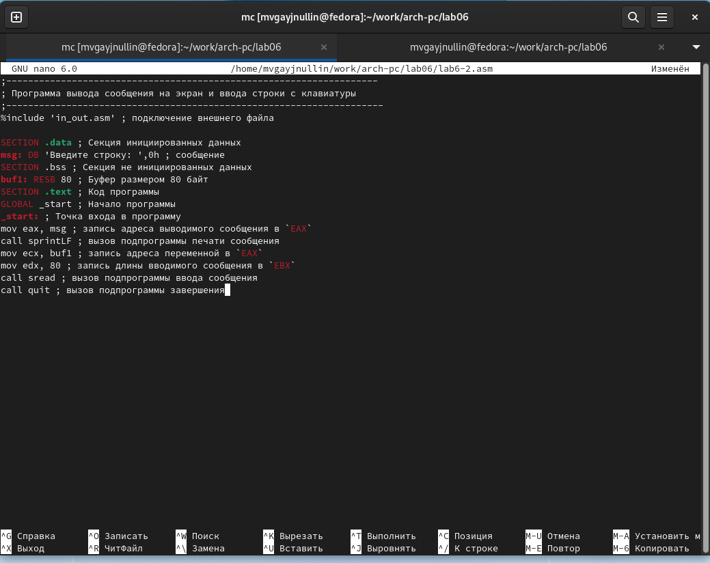

---
## Front matter
title: "Отчет по лабораторной 6"
author: "Гайнуллин Максим Васильевич"

## Generic otions
lang: ru-RU
toc-title: "Содержание"

## Bibliography
bibliography: bib/cite.bib
csl: pandoc/csl/gost-r-7-0-5-2008-numeric.csl

## Pdf output format
toc: true # Table of contents
toc-depth: 2
lof: true # List of figures
fontsize: 12pt
linestretch: 1.5
papersize: a4
documentclass: scrreprt
## I18n polyglossia
polyglossia-lang:
  name: russian
  options:
	- spelling=modern
	- babelshorthands=true
polyglossia-otherlangs:
  name: english
## I18n babel
babel-lang: russian
babel-otherlangs: english
## Fonts
mainfont: PT Serif
romanfont: PT Serif
sansfont: PT Sans
monofont: PT Mono
mainfontoptions: Ligatures=TeX
romanfontoptions: Ligatures=TeX
sansfontoptions: Ligatures=TeX,Scale=MatchLowercase
monofontoptions: Scale=MatchLowercase,Scale=0.9
## Biblatex
biblatex: true
biblio-style: "gost-numeric"
biblatexoptions:
  - parentracker=true
  - backend=biber
  - hyperref=auto
  - language=auto
  - autolang=other*
  - citestyle=gost-numeric
## Pandoc-crossref LaTeX customization
figureTitle: "Рис."
listingTitle: "Листинг"
lofTitle: "Список иллюстраций"
lolTitle: "Листинги"
## Misc options
indent: true
header-includes:
  - \usepackage{indentfirst}
  - \usepackage{float} # keep figures where there are in the text
  - \floatplacement{figure}{H} # keep figures where there are in the text
---

# Цель работы
Приобретение практических навыков работы в Midnight Commander. Освоение
инструкций языка ассемблера mov и int

# Выполнение лабораторной работы
ШАГ 1 С помощью функциональной клавиши F7 создали папку lab06 и перешли в созданный каталог, так же пользуясь строкой ввода и командой touch создаём файл lab6-1.asm
(рис. [-@fig:001])

ШАГ 2 Открыли файл и ввели текст программы из листинга 6.1, сохранили изменения. Также с помощью функциональной клавиши F3 открыли файл lab6-1.asm для
просмотра. Убедились, что файл содержит текст программы
(рис. [-@fig:002])

ШАГ 3 Оттранслировал текст программы lab6-1.asm в объектный файл. Выполнил компоновку объектного файла и запустил получившийся исполняемый
файл. Программа выводит строку 'Введите строку:' и ожидает ввода с
клавиатуры. На запрос ввёл своё ФИО.
(рис. [-@fig:003])

ШАГ 4 Скопировал файл in_out.asm в каталог с файлом lab6-1.asm
с помощью функциональной клавиши F5 
(рис. [-@fig:004])

ШАГ 5 С помощью функциональной клавиши F6 создал копию файла lab6-
1.asm с именем lab6-2.asm
(рис. [-@fig:005])

ШАГ 6 1)Исправил текст программы в файле lab6-2.asm с использование под-
программ из внешнего файла in_out.asm (использовал подпрограммы
sprintLF, sread и quit) в соответствии с листингом 6.2
2)В файле lab6-2.asm заменил подпрограмму sprintLF на sprint. Создал исполняемый файл и проверьте его работу. Увидел разницу

(рис. [-@fig:006])
(рис. [-@fig:007])
(рис. [-@fig:008])

САМОСТОЯТЕЛЬНАЯ РАБОТА
 ШАГ 1 Создал копию файла lab6-1.asm с именем lab6-3.asm 
 (рис. [-@fig:009])
 
 ШАГ 2 Внес изменения в программу (без
использования внешнего файла in_out.asm), так чтобы она работала по заданному алгоритму
(рис. [-@fig:010])

ШАГ 3 Проверил работу
(рис. [-@fig:011])

ШАГ 4 Создал копию файла lab6-2.asm с именем lab-4.asm
(рис. [-@fig:012])

ШАГ 5 Исправил текст программы с исполь-
зование подпрограмм из внешнего файла in_out.asm, так чтобы она ра-
ботала по заданному алгоритму
(рис. [-@fig:013])

ШАГ 6 Проверил работу 
(рис. [-@fig:014])

{ #fig:001 width=70% }

{ #fig:002 width=70% }

{ #fig:003 width=70% }

{ #fig:004 width=70% }

{ #fig:005 width=70% }

{ #fig:006 width=70% }

{ #fig:007 width=70% }

{ #fig:008 width=70% }

{ #fig:009 width=70% }

{ #fig:010 width=70% }

{ #fig:011 width=70% }

{ #fig:012 width=70% }

{ #fig:013 width=70% }

{ #fig:014 width=70% }

# Выводы

Приобрёл практические навыки работы в Midnight Commander. Освоил
инструкции языка ассемблера mov и int.

