---
## Front matter
title: "Лабораторная работа 7"
author: "Гайнуллин Максим"

## Generic otions
lang: ru-RU
toc-title: "Содержание"

## Bibliography
bibliography: bib/cite.bib
csl: pandoc/csl/gost-r-7-0-5-2008-numeric.csl

## Pdf output format
toc: true # Table of contents
toc-depth: 2
lof: true # List of figures
lot: true # List of tables
fontsize: 12pt
linestretch: 1.5
papersize: a4
documentclass: scrreprt
## I18n polyglossia
polyglossia-lang:
  name: russian
  options:
	- spelling=modern
	- babelshorthands=true
polyglossia-otherlangs:
  name: english
## I18n babel
babel-lang: russian
babel-otherlangs: english
## Fonts
mainfont: PT Serif
romanfont: PT Serif
sansfont: PT Sans
monofont: PT Mono
mainfontoptions: Ligatures=TeX
romanfontoptions: Ligatures=TeX
sansfontoptions: Ligatures=TeX,Scale=MatchLowercase
monofontoptions: Scale=MatchLowercase,Scale=0.9
## Biblatex
biblatex: true
biblio-style: "gost-numeric"
biblatexoptions:
  - parentracker=true
  - backend=biber
  - hyperref=auto
  - language=auto
  - autolang=other*
  - citestyle=gost-numeric
## Pandoc-crossref LaTeX customization
figureTitle: "Рис."
listingTitle: "Листинг"
lofTitle: "Список иллюстраций"
lolTitle: "Листинги"
## Misc options
indent: true
header-includes:
  - \usepackage{indentfirst}
  - \usepackage{float} # keep figures where there are in the text
  - \floatplacement{figure}{H} # keep figures where there are in the text
---

# Цель работы
Освоить арифметические инструкции языка ассемблера NASM.

# Выполнение лабораторной работы

ШАГ1 Создал каталог для программам лабораторной работы No 7, перешел в
него и создал файл lab7-1.asm 
(рис. [-@fig:001])

ШАГ2 Ввел в файл lab7-1.asm текст программы из листинга 7.1
(рис. [-@fig:002])

ШАГ3 Создал исполняемый файл и запустил его
(рис. [-@fig:003])

ШАГ4 Исправил текст программы (Листинг 1)
(рис. [-@fig:004])

ШАГ5 Создал исполняемый файл и запустил его
(рис. [-@fig:005])

ШАГ6 Создал файл lab07, ввел в него текст программы из листинга 7.2, а также создал исполняемый файл и запустил его
(рис. [-@fig:006])

ШАГ7 Заменил строки аналогично предыдущему примеру
(рис. [-@fig:007])

ШАГ8 Создал исполняемый файл и запустил его
(рис. [-@fig:008])

ШАГ9 Заменил функцию iprintLF на iprint и увидел другой результат
(рис. [-@fig:009])

ШАГ10 Создал файл lab7-3.asm в каталоге ~/work/arch-pc/lab07
(рис. [-@fig:010])

ШАГ11 Ввел текст программы в файл из листинга 7.3
(рис. [-@fig:011])

ШАГ12 Создал исполняемый файл и запустил его, увидел результат
(рис. [-@fig:012])

ШАГ13 Изменил текст программы для вычисления выражения (4*6+2)/5
(рис. [-@fig:013])

ШАГ14 Создал исполняемый файл и проверил его работу
(рис. [-@fig:014])

ШАГ15 Создал файл variant.asm в каталоге ~/work/arch-pc/lab07
(рис. [-@fig:015])

ШАГ16 Ввел в файл текст программы из листинга 7.4
(рис. [-@fig:016])

ШАГ17 Создал исполняемый файл и запустил его, проверил работу
(рис. [-@fig:017])

САМОСТОЯТЕЛЬНАЯ РАБОТА
ШАГ1 Написал программу для вычисления выражения из моего варианта 1
(рис. [-@fig:018])

ШАГ2 Проверил её работу, подставив значения х1=1 и х2=10
(рис. [-@fig:019])

ОТВЕТЫ НА ВОПРОСЫ
1)Какие строки листинга 7.4 отвечают за вывод на экран сообщения ‘Ваш
вариант:’?
Ответ: mov eax, msg call,sprintLF
2)Для чего используется следующие инструкции? nasm mov ecx, x
mov edx, 80 call sread?
Ответ: данные инструкции используются для ввода переменной икс с клавиатуры и сохранения введеных данных
3)Для чего используется инструкция “call atoi”?
Ответ: данная инструкция используется для преобразования кода переменной ASCII в число
4)Какие строки листинга 7.4 отвечают за вычисления варианта?
Ответ: mov ebx, 20 div inc edx
5)В какой регистр записывается остаток от деления при выполнении ин-
струкции “div ebx”?
Ответ: в регистр ebx
6)Для чего используется инструкция “inc edx”?
Ответ: для увеличения значения edx на 1
7)Какие строки листинга 7.4 отвечают за вывод на экран результата вычислений?
Ответ: mov eax, edx call iprintLF

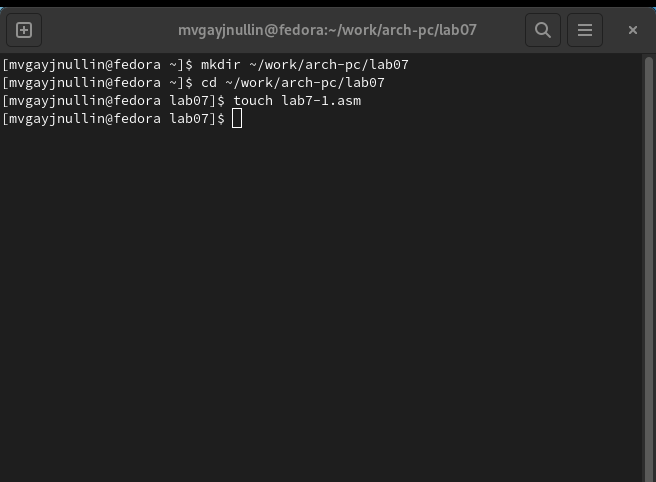{ #fig:001 width=70% }

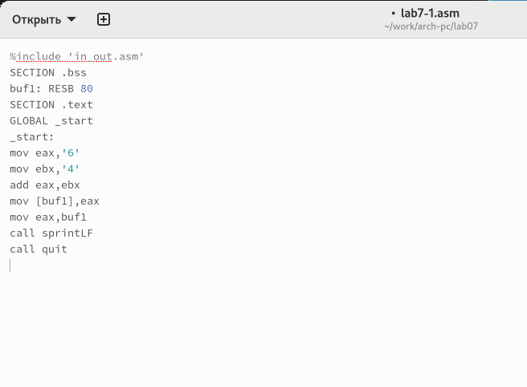{ #fig:002 width=70% }

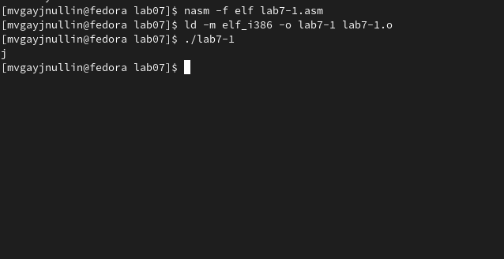{ #fig:003 width=70% }

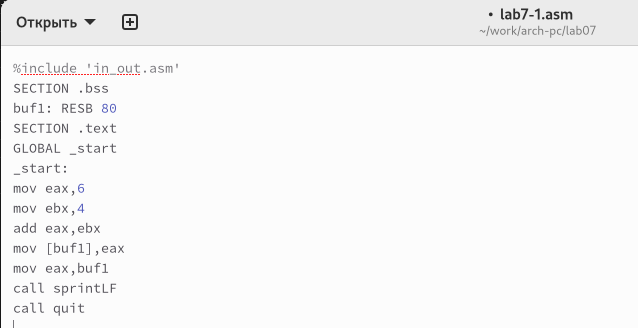{ #fig:004 width=70% }

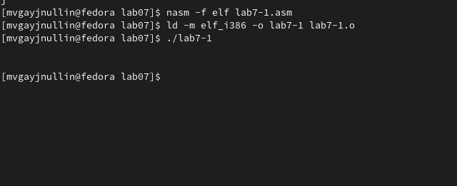{ #fig:005 width=70% }

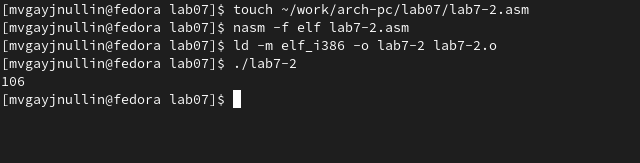{ #fig:006 width=70% }

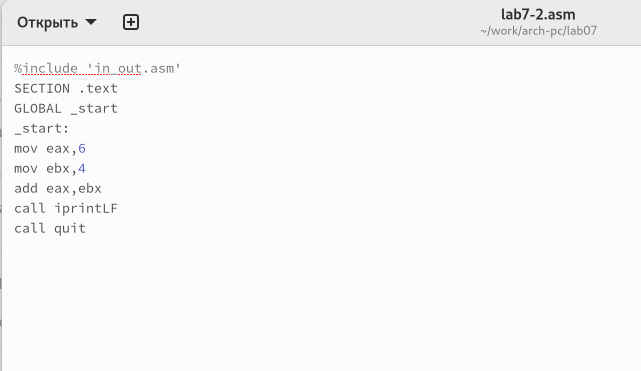{ #fig:007 width=70% }

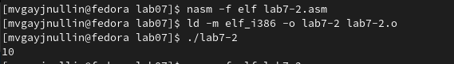{ #fig:008 width=70% }

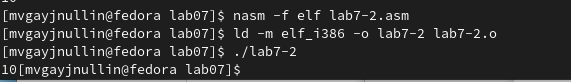{ #fig:009 width=70% }

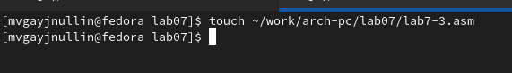{ #fig:010 width=70% }

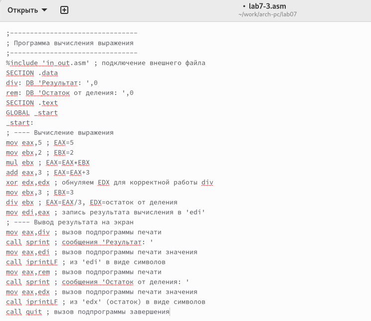{ #fig:011 width=70% }

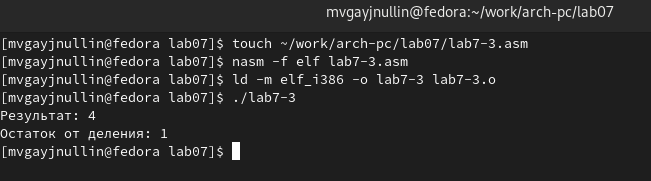{ #fig:012 width=70% }

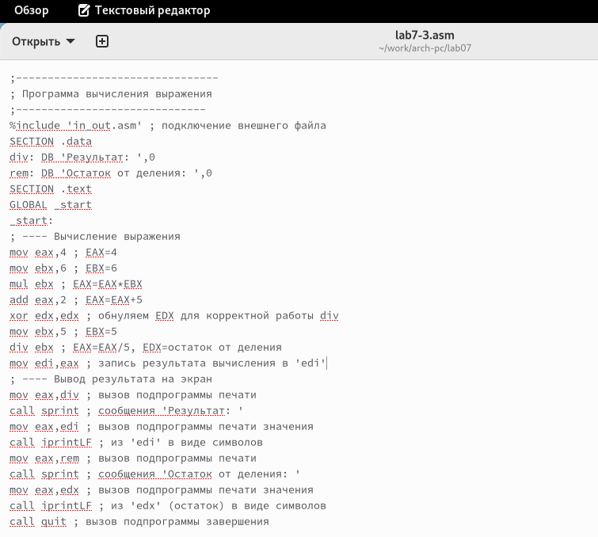{ #fig:013 width=70% }

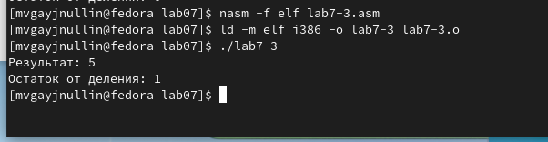{ #fig:014 width=70% }

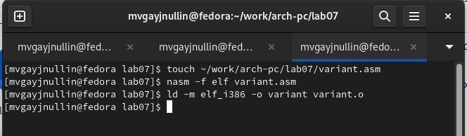{ #fig:015 width=70% }

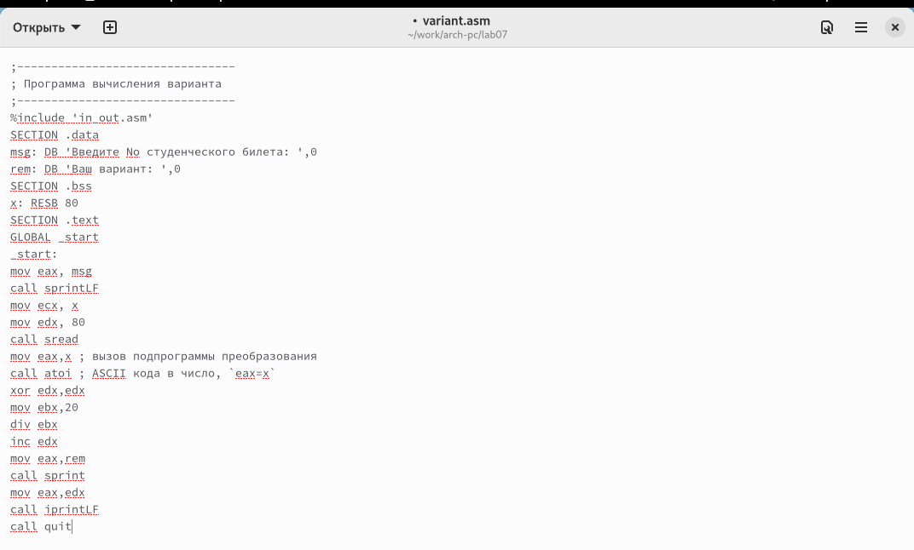{ #fig:016 width=70% }

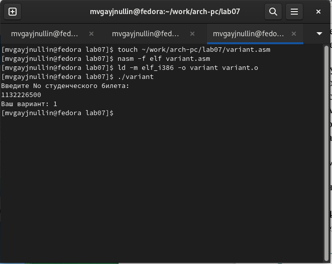{ #fig:017 width=70% }

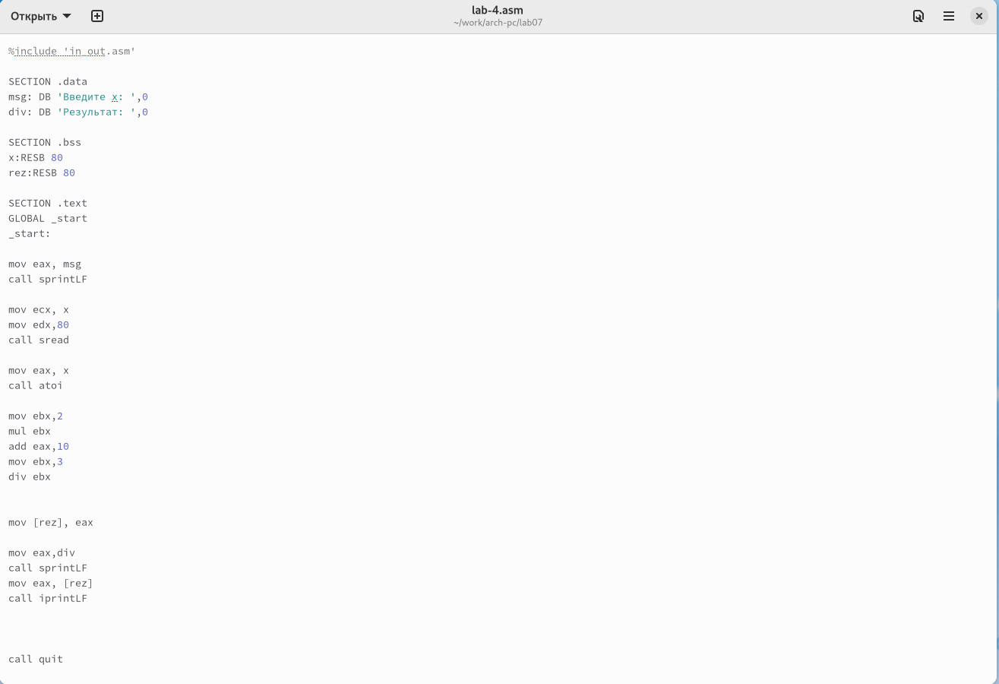{ #fig:018 width=70% }

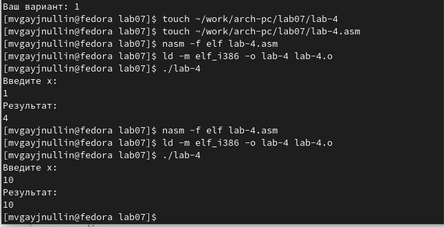{ #fig:019 width=70% }

# Выводы

В результате проделанной работы я освоил арифметические инструкции языка ассемблера NASM.

